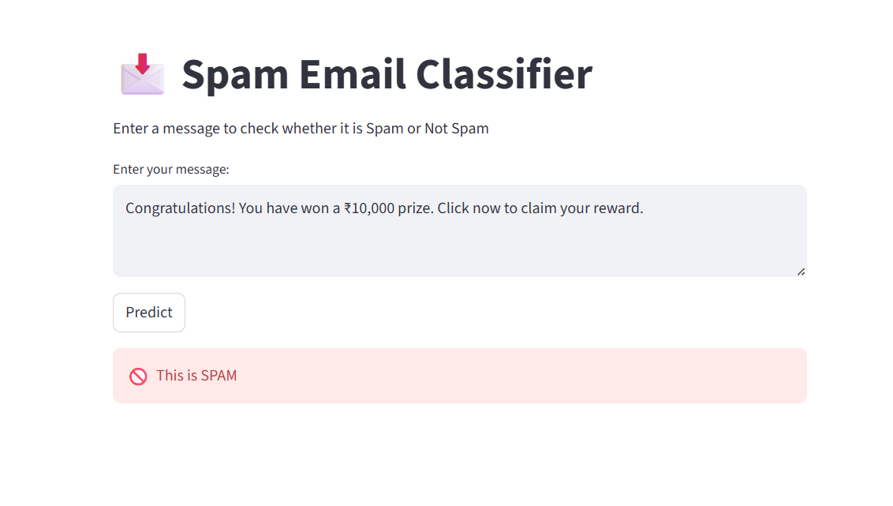
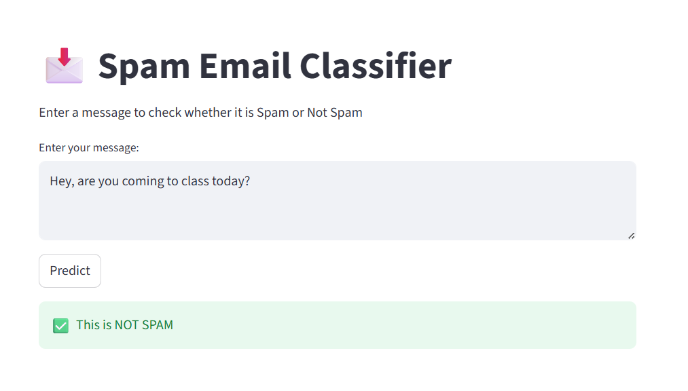

# 📩 Spam Email Classifier

This project is a Machine Learning-based web application that classifies messages as **Spam** or **Not Spam (Ham)** using Natural Language Processing (NLP).

---

## 🚀 Features

- Classifies messages into Spam or Not Spam
- Uses NLP techniques (TF-IDF)
- Machine Learning model (Naive Bayes)
- Simple and interactive web interface
- Deployed using Streamlit

---

## 🧠 How It Works

1. User enters a message
2. Text is converted into numerical form using TF-IDF
3. Trained Naive Bayes model predicts the result
4. Output is displayed instantly on the web app

---

## 🛠️ Technologies Used

- Python
- Pandas
- Scikit-learn
- Streamlit

---

## ▶️ Run Locally

Clone the repository:

```bash
git clone https://github.com/Archisahu27/spam-email-classifier.git
cd spam-email-classifier

Install dependencies:
pip install -r requirements.txt

Run the app:
streamlit run app.py

Live Demo:
https://spam-email-classifier-5lmqxuknhgp3ordmxqjv4p.streamlit.app/

## 📸 Screenshots

### Spam Prediction


### Not Spam Prediction
